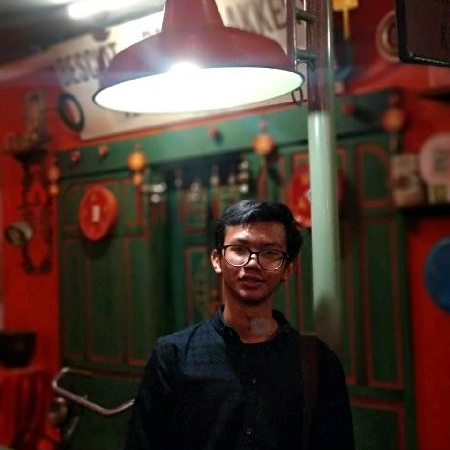

---
# Feel free to add content and custom Front Matter to this file.
# To modify the layout, see https://jekyllrb.com/docs/themes/#overriding-theme-defaults

layout: default
---

  

      
  

  

# Halo, saya Ahnaf Hadi Fathulloh.
## Bukan seorang programmer, tapi suka belajar dan membuat sesuatu dengan pemrograman.
  

## Blog

  <ul>
    
      
      <li>
        <h3 style="display:inline;"><a href="{{ post.url }}">{{ post.title }}</a></h3> - {{ post.date | date_to_long_string }}
      </li>
      
    
  </ul>

## Buku

  <ul>
    
      
      <li>
        <h3 style="display:inline;"><a href="{{ post.url }}">{{ post.title }}</a></h3>
      </li>
      
    
  </ul>

